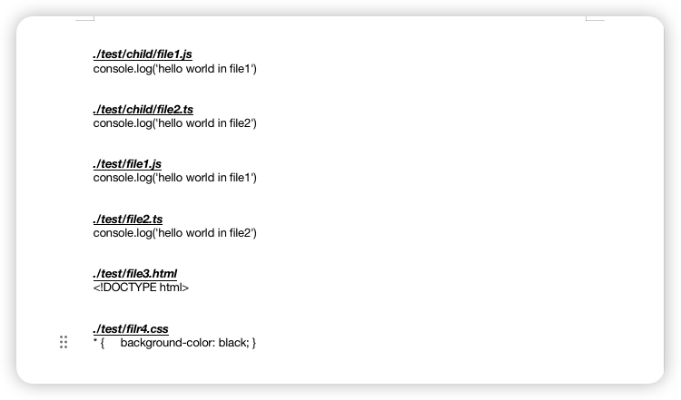

# code2doc

## 说明

此脚本用于申请软著时生成需要提供项目源码的 DOCX 文档.

脚本执行时会通过配置项中指定的入口目录`directory`配置开始遍历读取目录下所有的代码文件内容, 并将读取到的内容写入到 DOCX 文件中.

```
const config = {
    // 目标文档目录
    directory: './test',
    // 文档名称
    fileName: 'CodeDocument.docx',
    // 允许写入文档的文件扩展名
    extension: ['.js', '.ts', '.tsx', '.html', '.css'],
    // 是否深度遍历子文件夹
    depth: false
}

```

- 通过更改`src/docx.js`中的`generateParagraph`方法来指定要生成的段落格式.

- 通过更改`src/docx.js`中的`generateDocSection`来指定生成文档内容的规则, 可以是自定义的文件过滤或文件匹配规则等.

## 使用

```
// 安装依赖
yarn

// 运行
yarn generate
```

## 结果


